### 阅读书目
* C语言程序设计(第四版) -谭浩强 清华大学出版社

#### 章节与算法全览
章节算法|章节算法
:----------------------:|:----------------------:|
章节2算法案例|章节3算法案例
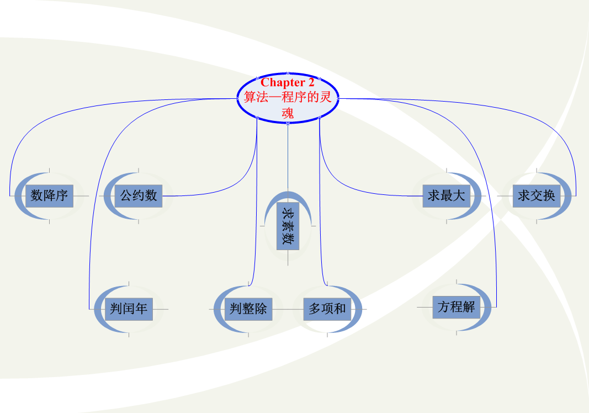|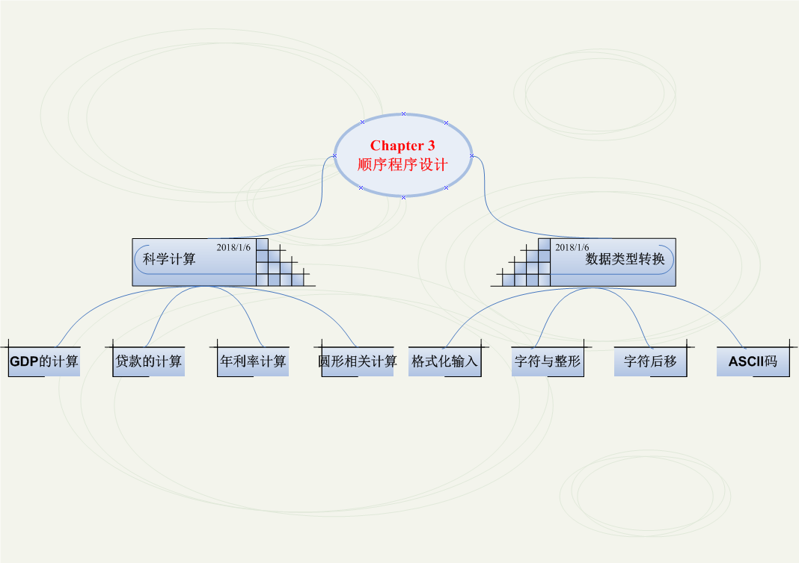
章节4算法案例|章节5算法案例
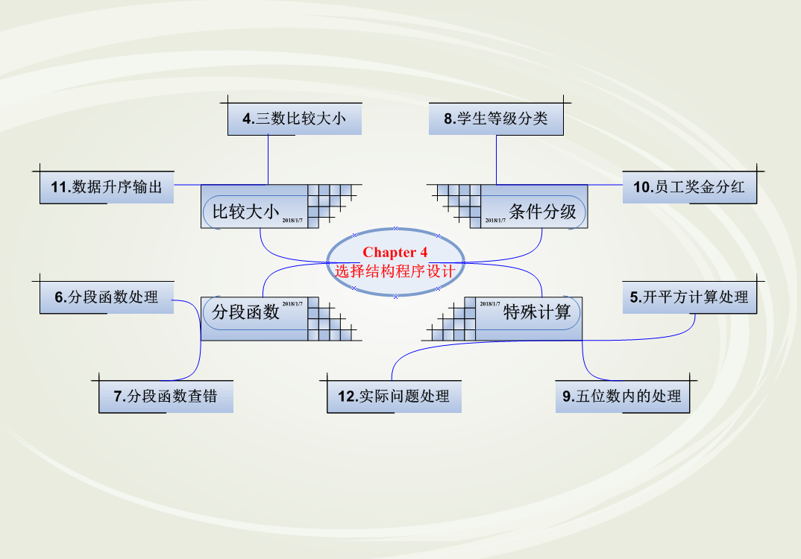|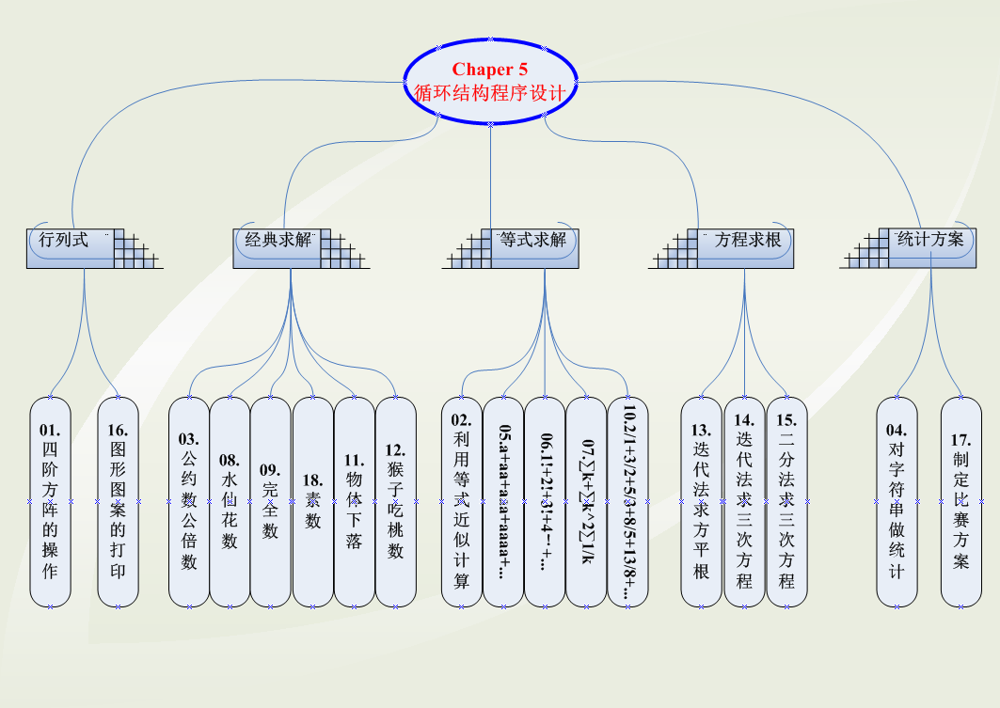
章节6算法案例|章节7算法案例
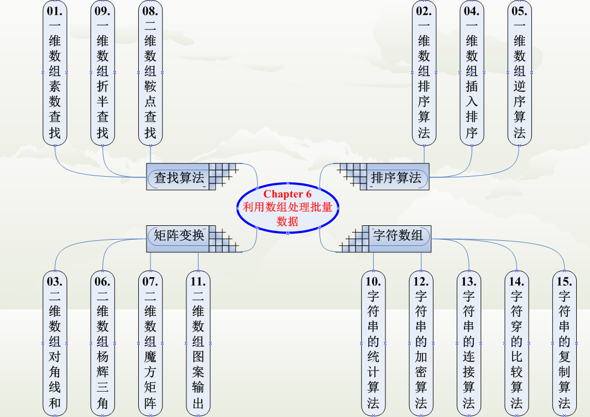|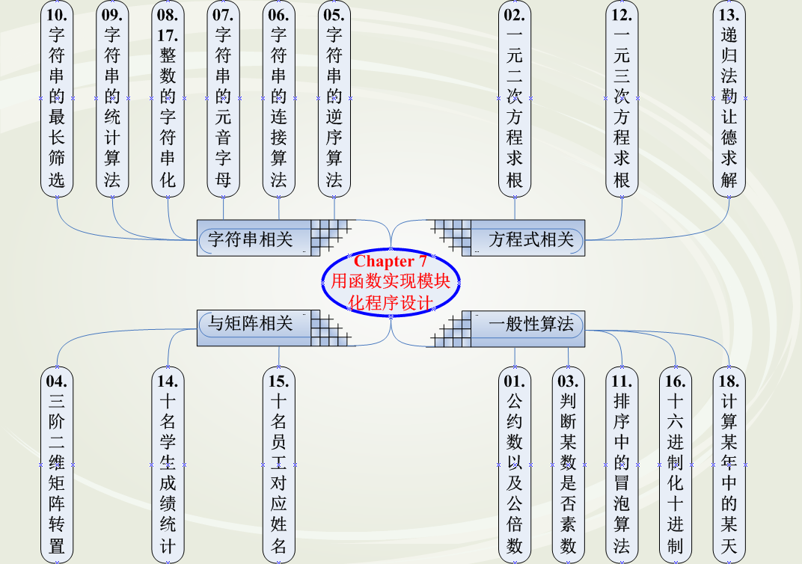
章节8算法案例|章节8知识点
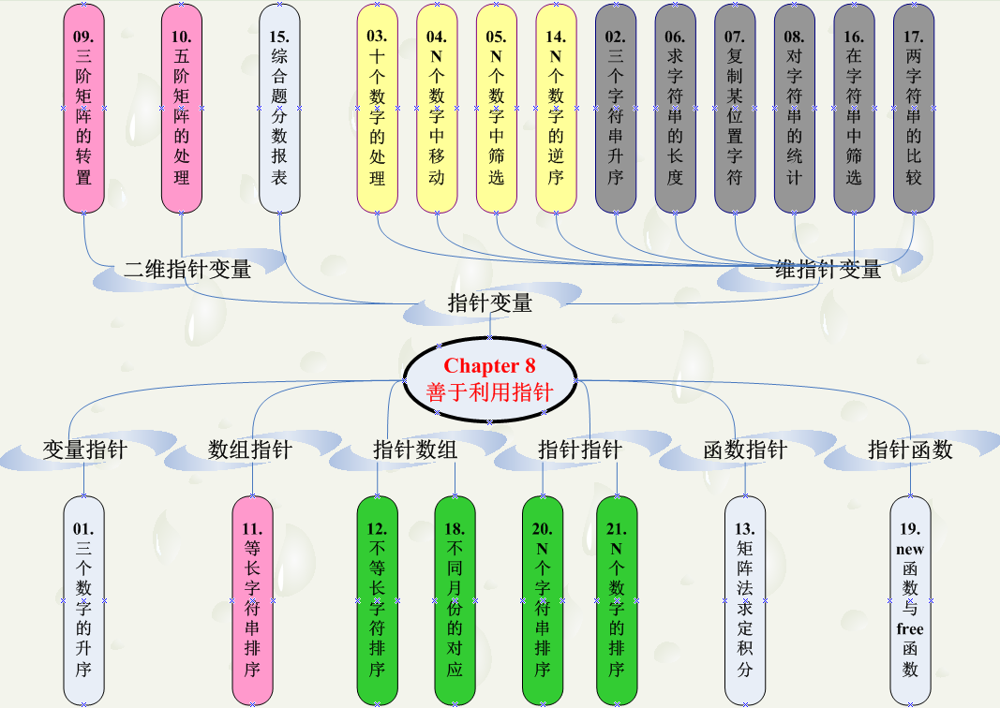|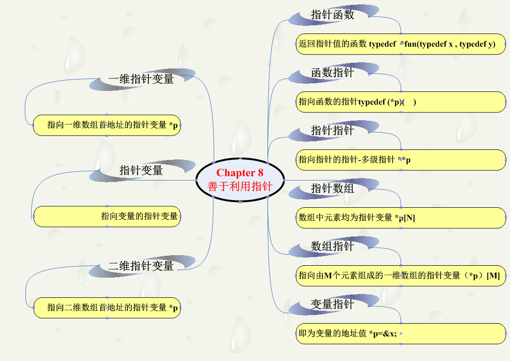
章节9算法案例|章节9习题
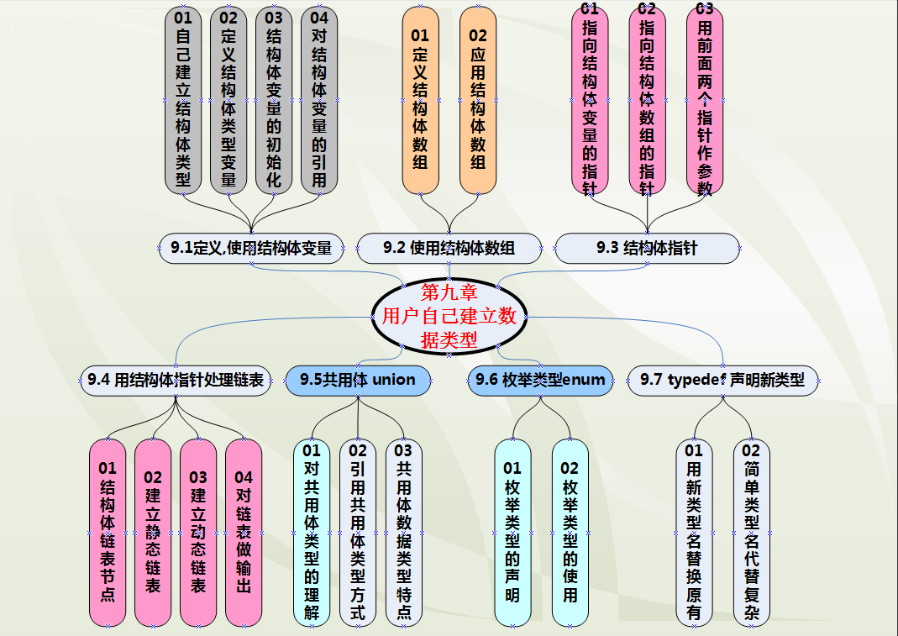|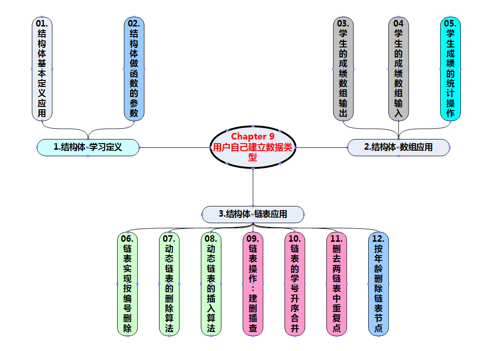
章节10算法案例|章节10习题
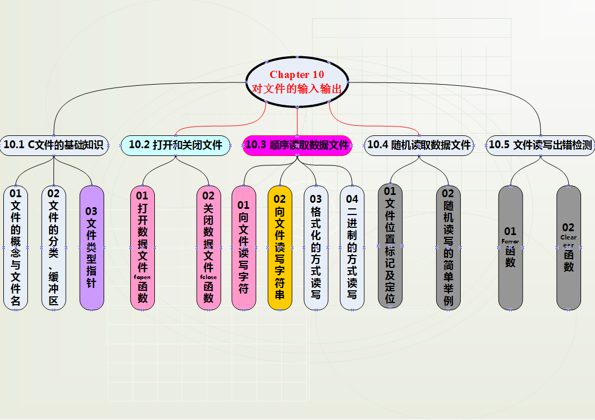|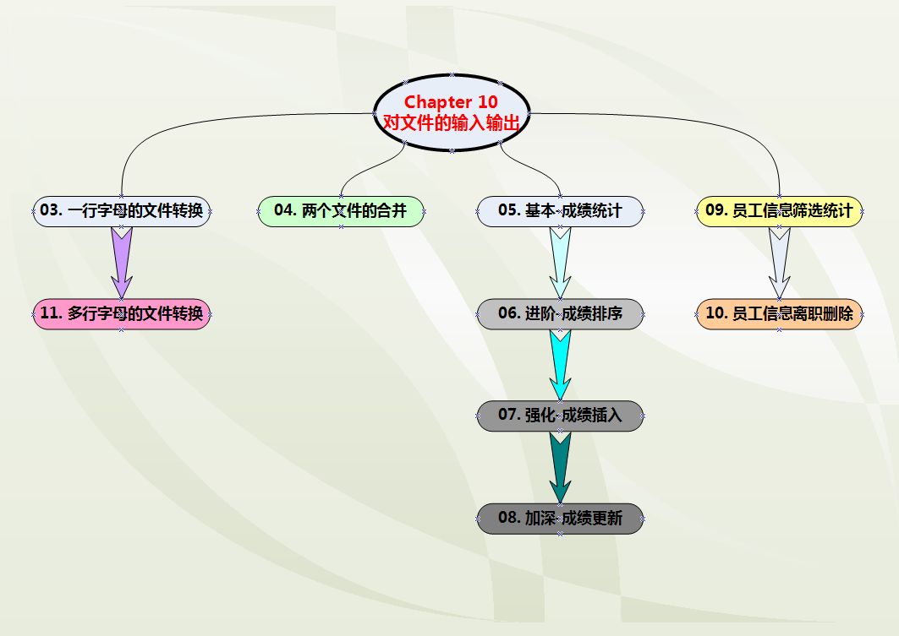